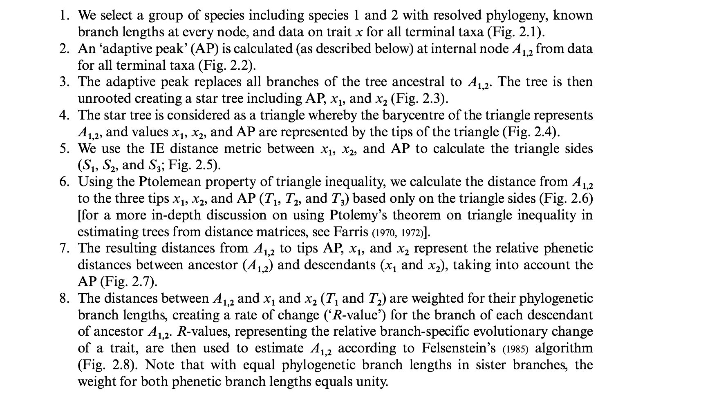
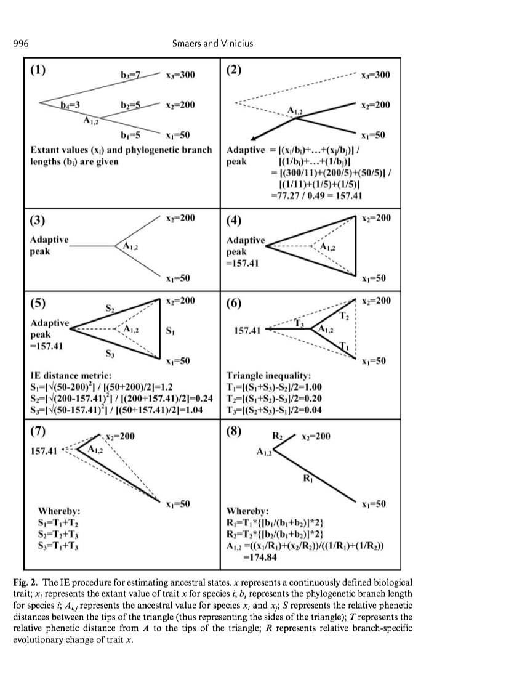
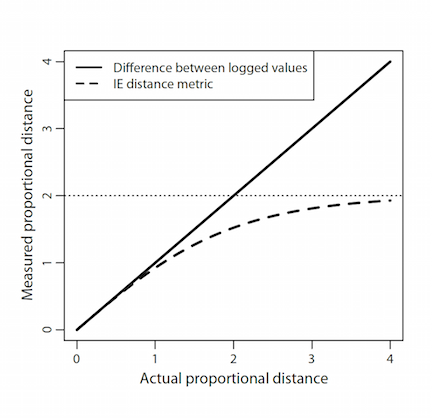
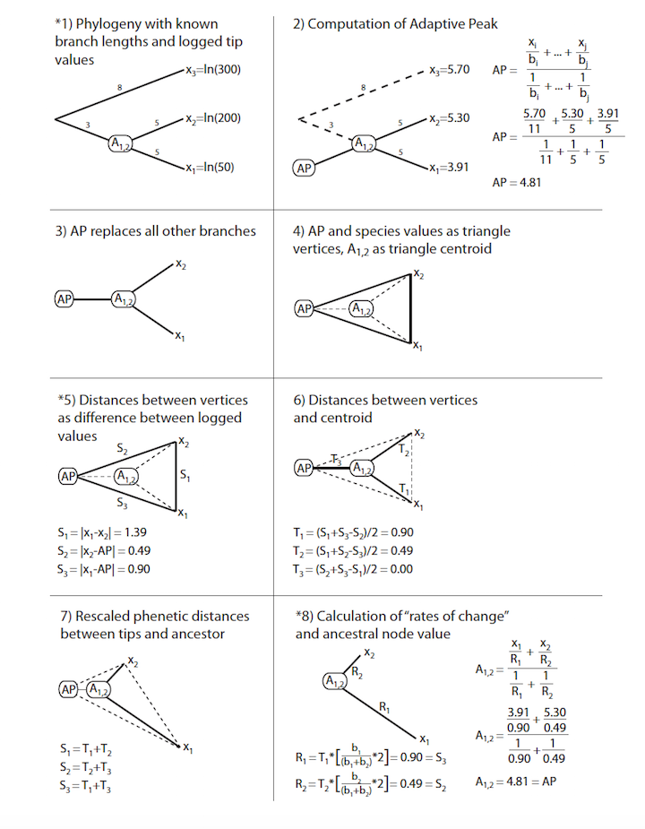
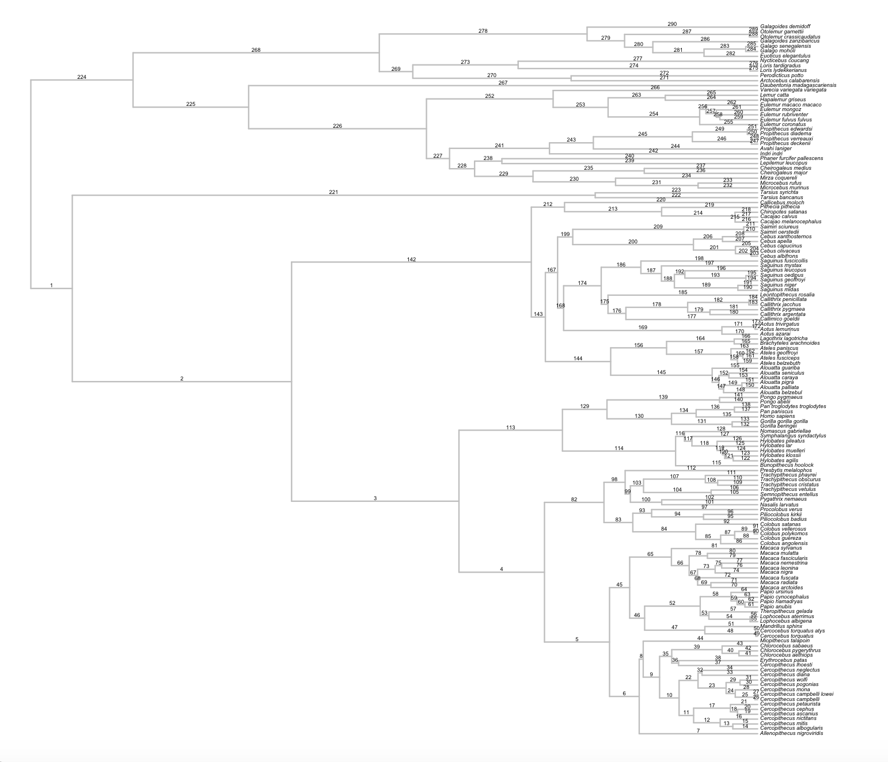
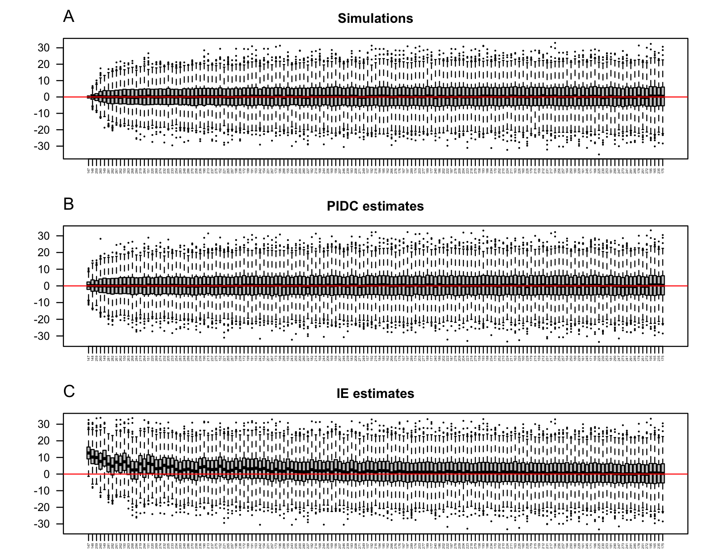
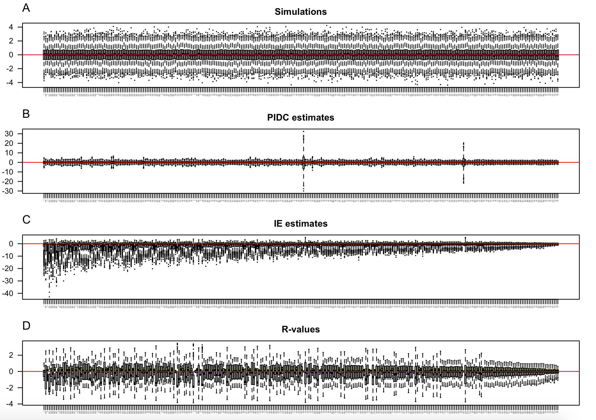
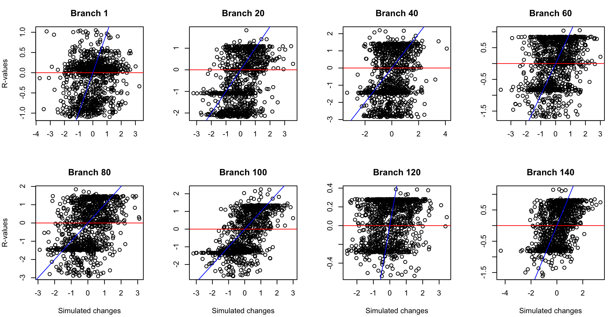
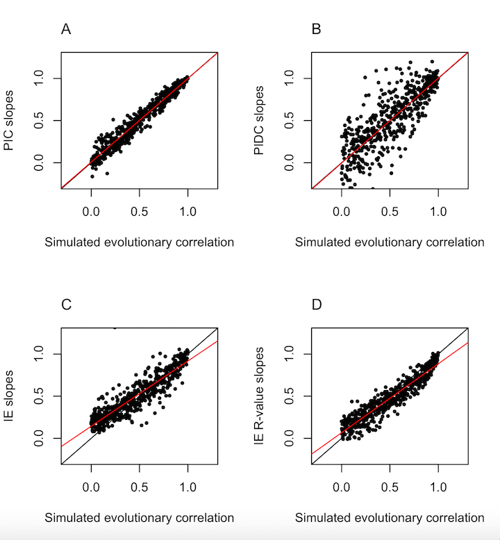

# SYNOPSIS: The Independent Evolution method is not a viable phylogenetic comparative method

[Randi H. Griffin]() and [Gabriel S. Yapuncich](http://www.gabrielyapuncich.com/)

* RHG authored this synopsis

___

## Introduction

In 2009, Smaers and Vinicius introduced a phylogenetic comparative method called Independent Evolution (IE), which aims to estimate ancestral states and rates of evolution given a phylogenetic tree and trait data at the tips. Purportedly, the method can also model the coevolution of pairs of traits more effectively than traditional methods (Smaers and Vinicius, 2009). Since its introduction, the method has been employed in numerous studies, mostly on the topic of human and primate evolution (Smaers et al., 2011; Smaers et al., 2012; Smaers et al., 2013; Smaers and Soligo, 2013; Tsegai et al., 2013; Kivell et al., 2013; Goswami et al., 2014). 

In 2014, my collaborator (Gabe) and I (Randi) read one of these papers, and we thought the method seemed fishy. Indeed, upon closer inspection, we found that IE makes virtually no theoretical sense and performs very poorly when evaluated with simulations. Although Smaers and Vinicius (2009) claim that IE produces identical results to a Brownian motion model of evolution when the assumptions of that model are met, by testing the IE method with data simulated under Brownian motion, we found that this is far from true. 

In this synopsis, I briefly highlight theoretical and computational problems with the IE method, and then present results from our simulation study. The simulations are focused on comparing the performance of IE with Phylogenetically Independent Contrasts (PIC), a traditional phylogenetic comparative method that assumes evolution occurs according to a Brownian motion process (Felsenstein, 1985). 

## Theoretical and computational problems with Independent Evolution

We dedicate plenty of space to discussing the problems of IE in our manuscript, so I am going to keep this section brief. If you are more interested in the question *Does IE work?* rather than *Why doesn't IE work?*, you may as well skip to the simulation study.  

### What is Independent Evolution?

IE is a tree-traversal algorithm that supposedly produces amazingly accurate estimates of ancestral states and branch-specific rates of change for a given phylogeny and trait data. The algorithm involves 8 steps, and is described in Smaers and Vinicus (2009) as follows:

Here is a visual depiction of the IE algorithm taken directly from Smaers and Vinicius (2009):

Applying IE to a phylogeny and dataset involves two steps: First, "adaptive peaks" are calculated for all the internal nodes of the tree, where the "adaptive peak" at a node is defined as the phylogenetically weighted average at that node when the phylogeny is re-rooted at the node in question. Second, the phylogeny is traversed and "*R*-values" and ancestral states are computed for branches and internal nodes as described in the 8-step algorithm. The *R*-values are considered by Smaers and Vinicius (2009) to represent "branch-specific rates of change". 

If you find this process to be strange, confusing, or disorienting, don't worry. You are not alone.

### Problems with Independent Evolution

After much thought and discussion, Gabe and I distilled various issues with the IE method down to 8 main problems. There is a 13 page discussion in our manuscript, but here are the bare bones:

1. **The "IE distance metric" is a transformation designed to account for proportional change, but it introduces biases because the function asymptotes at +/-2.** In Smaers et al. (2012), the authors write that the IE distance metric has "equivalent properties to the log-scale" (p. 18010), but this is not true. The following figure compares the IE distance metric to taking the difference between logged values (a sensible way to account for traits that scale proportionally), and demonstrates that IE always underestimates proportional change, and the problem gets worse when changes are large.

  

2. **The IE distance metric is embedded in the IE algorithm, such that even if trait data do not require transformation, they are automatically transformed.** Specifically, IE assumes that the variance of the trait increases (and non-linearly) with the mean. Since IE assumes the data follow a distribution that requires transformation, this assumption should hold for any data that is analyzed with the method. However, the authors of IE do not highlight this assumption, and the method has used with data that clearly violate it, such as the prinicipal components scores in Kivell et al. (2013). 

3. **The formulas used in steps 6 and 7 of the IE algorithm are non-sensical.** In steps 6 and 7, "*T*-distances" are calculated from the triangle vertices to the centroid, and are then related to the triangle sides, or "*S*-distances". This is probably the silliest problem with IE because it doesn't really make sense to do either of those things in the first place, but our point is that even if it did make sense, they are doing it wrong. You can't use Ptolemy's triangle inequality to compute distances to the triangle centroid, you need [Apollonius' theorem](https://en.wikipedia.org/wiki/Median_%28geometry%29#Formulas_involving_the_medians.27_lengths) for that (use Apollonius' theorem to compute the triangle median lengths, then multiply by 2/3 to get the distances to the centroid). Further, step 7 of the IE algorithm says that each *S*-distance is equal to the sum of the *T*-distances it forms a triangle with, but if that is true, then the triangle formed by the *S*-distance and *T*-distances must have an area of 0!

  

4. **R-values are not evolutionary rates.** Given phenetic distance *T* between an ancestor and descendant, and branch length *b* connecting them, the average rate of change along the branch could be computed as *T/b*. In comparison, Step 8 of the IE algorithm multiplies *T*-distances by the quantity 2\**b*1/(*b*1 + *b*2), where *b*1 and *b*2 are branch lengths leading from the ancestral node to sister descendants. It is unclear why this particular equation is used to scale *T*-values, but we see no justification for interpreting the resulting *R*-value as as a rate of evolutionary change. Given that the *S*-distances and *T*-distances upon which the *R*-values are based are problematic due to the inappropriate formulas used to compute them, it is very difficult to say what the *R*-values represent. As we will demonstrate in the simulations, *R*-values are very poorly correlated with true branch-specific rates of change and exhibit unusual distributions.

5. **Adaptive peaks are computed without considering proportional scaling of data (even though proportional scaling of data is an assumption of the method), and the result is the systematic overestimation of ancestral states throughout the phylogeny.** While the IE distance metric provides a partial (though biased) correction for proportionality, this metric is not applied until after the adaptive peak has been computed from raw trait data. Thus, when data scales proportionally (as the IE method assumes), extreme tip values have a strong impact on adaptive peak values throughout the tree, and the IE algorithm mis-estimates the weighted average of the tips. Since ancestral states are triangulated from these adaptive peaks, the IE algorithm will systematically bias ancestral states. The IE algorithm has primarily been applied to traits with positive values (such as body or brain mass); in these cases, the bias is expressed as a systematic overestimation of ancestral states.

6. **Ancestral states and branch-specific rates of change are not statistically independent.** IE aims to estimate branch-specific rates of change for every ancestor-descendant pair in the phylogeny, such that the algorithm generates 2*n* – 2 estimates from n observations. Unfortunately, these estimates cannot be statistically independent of one another because some ancestors are also descendants, and are therefore components of multiple estimates.  Non-independence is also a major problem for estimated adaptive peaks and ancestral states, since the same set of tip values are used to compute all *n* – 1 adaptive peaks, and the adaptive peaks are then used to triangulate ancestral states throughout the tree. This presents a serious autocorrelation problem for analyses that are based on using IE estimated branch-specific rates of change in regression analyses (e.g., Smaers et al., 2012).

7. **The definition of "adaptive peaks" makes no theoretical sense.** In fact, it seems that the recovery of an "adaptive peak" in the example provided by Smaers and Vinicius (2009) is essentially a byproduct of transforming data mid-way through the algorithm and introducing bias with the IE distance metric. To demonstrate this, we worked through the same example, except we log transformed data prior to analysis and used an appropriate distance metric (log(a) - log(b)) in step 5 of the algorithm. We found that after implementing these changes, the "adaptive peak" and the ancestral state were identical (in our manuscript, we also provide an algebraic proof to demonstrate that this MUST be true whenever the branch lengths leading to sister taxa are identical and the "adaptive peak" lies between the values of the sister taxa).

  

8. **When branch-specific changes for one trait are regressed against those of a second trait, contrary to the claims of Smaers et al. (2012), the results do not provide any information that could not be gleaned from a standard phylogenetic regression.** Recent application of IE reveals a serious misinterpretation of the linear regression slope estimated for two sets of IE "branch-specific rates of change". Specifically, Smaers et al. (2012) argue that the null expectation for this regression slope should be 1, claiming that an allometric scaling relationship will “collapse” into the line *y* = *x* when rates of change between data points are plotted rather than the data points themselves. They then interpret deviations from the line *y* = *x* as providing novel insights to the evolutionary process leading to observed trait covariation across the phylogeny. In our manuscript, we discuss the problems with this argument in depth, but here I will simply say this: The expectation for the regression slope for a pair of IE "branch-specific rates of change" is not 1; rather, it is simply the regression slope for those two traits from a standard phylogenetic regression! In other words, regressing one set of IE "branch-specific rates of change" against another simply estimates the phylogenetic regression slope, albeit not as well as traditional methods. But don't take my word for it- check out the simulations.

## Simulation study

### Evolution of a single trait

We used the `phytools` package (Revell 2013) to simulate the evolution of 1000 proportionally scaling traits on a primate phylogeny from 10kTrees (Arnold et al., 2010). Here is the phylogeny with labeled branches:

On a log scale, the simulated traits are normally distributed with a mean of 0 and a standard deviation of 1. For each simulated trait, we used the IE algorithm to compute ancestral states for each node, standardized directional contrasts for each branch (measured as the value of the descendant minus the ancestor, divided by the square root of the branch length), and *R*-values for each branch. As required by the IE algorithm, proportionally scaling traits were not transformed in prior to analysis with IE.

For comparison, we implemented the Phylogenetically Independent Contrasts algorithm (PIC; Felsenstein 1985) to compute ancestral states using the `ape` package (Paradis et al., 2004). Because PIC assumes traits are normally distributed with constant variance, traits were log transformed prior to analysis. PIC is designed to produce *n* - 1 independent cross-sectional contrasts (one contrast for each node of the phylogeny), but for the purposes of making a direct comparison to IE, we modified the PIC algorithm to compute 2*n* - 1 directional contrasts that are not entirely independent (one contrast for each branch of the tree). Therefore, we use the terminology Partially Independent Directional Contrasts (PIDC) to refer to the estimation of branch-specific changes based on PIC ancestral states. 

In order to compare ancestral state estimates from IE and PIDC, we log transformed IE estimates to put them on the same scale as PIDC estimates. We expected PIDC estimates of ancestral states and branch-specific changes to be normally distributed around a mean of 0. In contrast, for the IE algorithm, we expect that the failure to log-transform values prior to computing the adaptive peak will bias ancestral states deeper in the tree towards increasingly large positive values. 

Our simulations supported our predictions. The following figure shows the distribution of ancestral state estimates across nodes of the tree, with nodes ordered by their distance from the root (nodes on the leftmost side of the plots are near the root, and nodes on the right are near the tips). 

Clearly, IE systematically overestimates ancestral states, and this problem is most extreme for nodes deeper in the tree. 

We also investigated the distribution of estimated "branch-specific rates of change" for each branch of the phylogeny, considering both standardized directional contrasts and *R*-values. The following figure depicts these distributions:

PIDC estimates of branch-specific change are evenly distributed across a mean of zero (larger standard deviations are associated with short branches). In contrast, IE estimates show a strong negative bias that increases near the root of the tree. This is expected given the upward bias in ancestral state estimates; overestimated ancestral states near the root correspond to a negative bias in changes along branches near the root. The results for *R*-values are much more variable, with some branches having a positive bias and others having a negative bias, and the overall magnitude of *R*-values decreasing towards the tips of the tree. 

Closer inspection of *R*-values on individual branches of the tree reveal erratic patterns and very little correspondence to the simulated evolutionary changes along those branches. The following plot depicts the relationship between *R*-values and simulated changes along select branches of the phylogeny.

Taken together, these results support our prediction that IE estimates of ancestral states and branch-specific changes (as measured by standardized directional contrasts) show systematic biases, essentially reflecting a model of evolution where trait values decrease in both their mean and variance through evolutionary time. *R*-values behave erratically and are very poorly correlated with branch-specific changes. 

### Correlated evolution of a pair of traits

We simulated the evolution of 500 pairs of correlated traits, incrementing the simulated correlation coefficient from 0 to 1 across the 500 trait pairs. We then computed standardized directional contrasts and *R*-values independently for each trait, and estimated the regression coefficient for pairs of directional contrasts and *R*-values. For comparison, we also analyzed pairs of correlated traits with both traditional PIC and PIDC. For PIC, we computed *n* – 1 independent contrasts for each trait and then estimated regression coefficients for each pair of independent contrasts. For PIDC, we computed 2*n* – 2 standardized directional contrasts, and then performed regressions for pairs of directional contrasts. For all regression models, ordinary least squares models were fitted through the origin (as required for methods based on contrasts; Felsenstein 1985).

All of our traits were simulated with the same evolutionary model, and the only source of variation between simulations was the correlation coefficient between the two traits. Thus, if regressing IE branch-specific changes from one trait against another captures something about the evolutionary process that is independent of the underlying correlation between the two traits (as argued by Smaers et al., 2012), the regression slopes for all the IE analyses should be identical (and according to Smaers et al., 2012, they should all be ~1). In fact, comparing the estimated regression slopes with simulated correlation coefficients supports our prediction that all three methods (PIC, PIDC, and IE) estimate the same parameter: the evolutionary correlation between the two traits!

Although IE regression does not estimate the correlation coefficient as accurately as PIC or PIDC (both IE standardized directional contrasts and R-values tend to overestimate the correlation at lower values and underestimate it at higher values), it is clearly closely related to the underlying evolutionary correlation between those two traits. 

## Conclusions

The IE method is both theoretically and empirically problematic. When data are simulated under a Brownian motion model, the method produces severely biased estimates of ancestral states and changes along individual branches. Furthermore, when IE estimated branch-specific changes are regressed against one another, they simply estimate that regression coefficient for the two traits and do not provide any novel insight into evolutionary processes. Given the extent of the problems we uncovered and the lack of a coherent theoretical foundation for the method, we see no way for it to be salvaged with revisions.

## References

- Arnold C, Matthews LJ, Nunn CL. The 10kTrees Website: a new online resource for primate phylogeny, v3. Evol Anthropol. 2010;19: 114–118.

- Felsenstein J. Phylogenies and quantitative characters. Ann Rev Ecol Syst. 1988;19: 445-471.

- Goswami A, Smaers JB, Soligo C, Polly PD. The macroevolutionary consequences of phenotypic integration: from development to deep time. Proc Biol Soc. 2014;369: 20130254.

- Kivell TL, Barros AP, Smaers JB. Different evolutionary pathways underlie the morphology of wrist bones in hominoids. BMC Evol Biol. 2013;13: 229.

- Paradis E, Claude J, Strimmer K. APE: analyses of phylogenetics and evolution in R language. Bioinformatics. 2004;20: 289-290.

- Revell LJ. phytools: An R package for phylogenetic comparative biology (and other things). Methods Ecol Evol. 2012;3: 217-223.

- Smaers JB, Dechmann DKN, Goswami A, Soligo C, Safi K. Comparative analyses of evolutionary rates reveal different pathways to encephalization in bats, carnivorans, and primates. Proc Natl Acad Sci U S A. 2012;109: 18006-18011.

- Smaers JB, Soligo C. Brain reorganization, not relative brain size, primarily characterizes anthropoid brain evolution. Proc Biol Sci. 2013;280: 20130269.

- Smaers JB, Steele J, Case CR, Amunts K. Laterality and the evolution of the prefronto-cerebellar system in anthropoids. Ann N Y Acad Sci. 2013;1822: 59-69.

- Smaers JB, Steele J, Zilles K. Modeling the evolution of cortico-cerebellar systems in primates. Ann N Y Acad Sci. 2011;1225: 176-190.

- Smaers JB, Vinicius L. Inferring macro-evolutionary patterns using an adaptive peak model of evolution. Evol Ecol Res. 2009;11: 991-1015.

- Tsegai ZJ, Kivell TL, Gross T, Nguyen NH, Pahr DH, Smaers JB, Skinner MM. Trabecular bone structure correlates with hand posture and use in hominoids. PLoS One. 2013;8: e78781.
